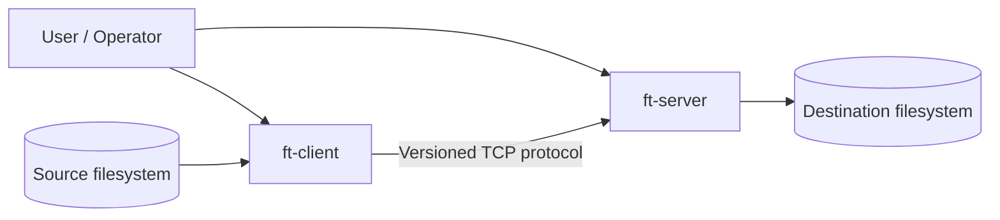
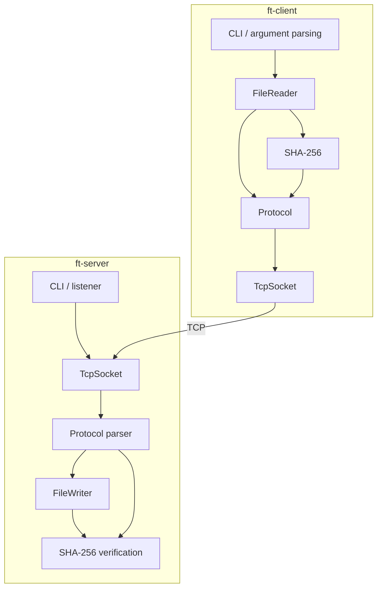
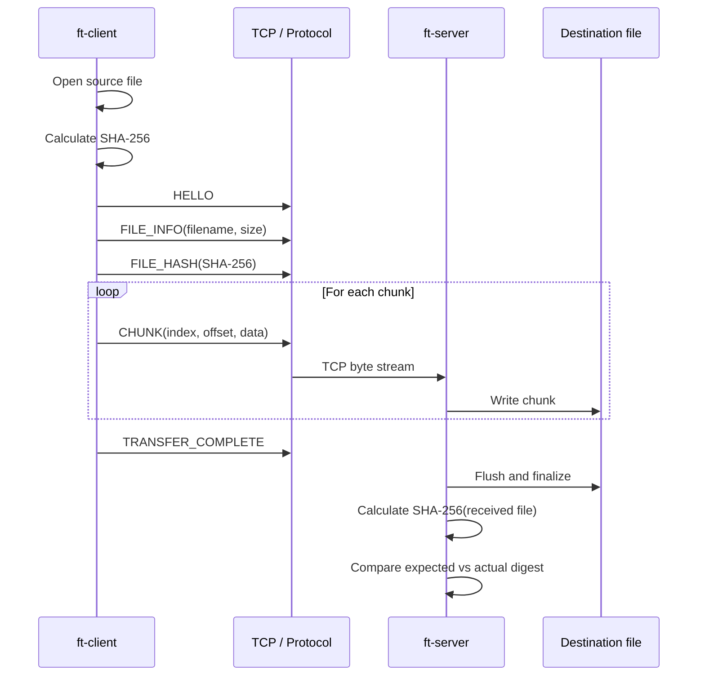

# TCP File Transfer Utility — Architecture & Design

## 1. Overview

This document describes the architecture and design of the TCP file-transfer utility used for the ATI Platform Engineer screening assignment.

The implementation is a C++17 client/server application with a small versioned application-layer protocol over TCP. Files are streamed in bounded chunks rather than loaded completely into memory. The `feature/file-integrity` implementation also provides end-to-end SHA-256 verification of the transferred file.

The implementation targets Linux/WSL and Windows. Platform-specific socket operations are isolated behind the `TcpSocket` abstraction, while the protocol, file-transfer, and SHA-256 layers remain platform-independent.

## 2. Design goals

- Transfer files reliably over TCP.
- Support files up to 16 GiB using 64-bit sizes and offsets.
- Stream file data with bounded memory usage.
- Provide deterministic application-layer framing over TCP's byte stream.
- Validate protocol input before allocating or writing data.
- Prevent unsafe destination filenames/path traversal.
- Verify end-to-end file integrity with SHA-256.
- Keep the implementation portable across Linux and Windows.
- Keep native application code separate from the Docker deployment branch.
- Make the code testable through CTest and an end-to-end Python integration test.

## 3. C4 — System context



The client is a one-shot transfer application. The server is a long-running listener that accepts client sessions sequentially. The two applications communicate only through the defined TCP application protocol.

## 4. C4 — Container/component view



### Responsibilities

| Component | Responsibility |
|---|---|
| `ft-client` | Parse CLI input, open source file, calculate SHA-256, send metadata/hash/chunks, report progress. |
| `ft-server` | Listen for clients, enforce message ordering, write received chunks, calculate received-file SHA-256, compare hashes, report errors. |
| `FileReader` | Validate source file and expose bounded chunks. |
| `FileWriter` | Validate destination filename, enforce expected file/chunk sizes, stream data to disk. |
| `Sha256` | Incremental SHA-256 implementation plus file hashing helper. |
| `Protocol` | Encode/decode headers and message payloads and enforce protocol limits. |
| `TcpSocket` | Cross-platform TCP socket abstraction and network runtime management. |

## 5. Layered architecture

```text
+-------------------------------------------------------------+
| CLI / Application                                            |
| ft-client                         ft-server                  |
+-------------------------------------------------------------+
| Transfer                                                      |
| FileReader                         FileWriter                |
+-------------------------------------------------------------+
| Integrity                                                     |
| SHA-256 generation               SHA-256 verification        |
+-------------------------------------------------------------+
| Protocol                                                      |
| Framing | message types | payload validation | byte order   |
+-------------------------------------------------------------+
| Network                                                       |
| TcpSocket | connection lifecycle | send_all/receive_all      |
+-------------------------------------------------------------+
| Operating System                                              |
| POSIX sockets / Winsock                                      |
+-------------------------------------------------------------+
```

The layering keeps application behavior independent of the operating system's socket API. It also makes the protocol and cryptographic functionality directly unit-testable.

## 6. Protocol design

The wire protocol uses a fixed 16-byte header:

```text
+----------+---------+------+----------+----------------+
| Magic    | Version | Type | Reserved | Payload Size   |
| uint32   | uint16  | u8   | u8       | uint64         |
+----------+---------+------+----------+----------------+
```

All multi-byte values are encoded in big-endian/network byte order.

Current message types:

| Type | Value | Purpose |
|---|---:|---|
| `Hello` | 1 | Starts a client session. |
| `FileInfo` | 2 | Announces filename and expected file size. |
| `Chunk` | 3 | Carries one bounded file-data chunk with index and offset. |
| `TransferComplete` | 4 | Indicates that all chunks have been sent. |
| `Error` | 5 | Carries an application-level error message. |
| `FileHash` | 6 | Carries the expected 32-byte SHA-256 digest. |

The protocol has a version field so future incompatible wire-format changes can be detected explicitly.

### Protocol validation

The receiver validates:

- protocol magic
- protocol version
- known message type
- payload size limits
- filename length
- file-size limits
- SHA-256 digest length
- chunk size
- chunk index ordering
- chunk offset ordering
- received size versus announced size

The current implementation limits the file size to 16 GiB, uses a default 4 MiB transfer chunk, and permits chunks up to 16 MiB.

## 7. Transfer sequence



The server only reports a successful transfer after the received file's SHA-256 matches the digest supplied by the client.

## 8. Integrity design

The client calculates SHA-256 before sending the file and transmits the 32-byte digest in a dedicated `FileHash` message. The server stores that expected digest, receives the file, calculates SHA-256 over the completed destination file, and compares the two values.

```text
Original file
     |
     +---- SHA-256 ----> Expected digest
     |
     +---- chunks ------> TCP
                              |
                              v
                        Received file
                              |
                         SHA-256
                              |
                              v
                         Actual digest
                              |
                   +----------+----------+
                   |                     |
                 MATCH               MISMATCH
                   |                     |
                PASS                 ERROR
```

The repository includes:

- SHA-256 known-vector unit tests.
- Incremental/chunked hashing tests.
- File hashing tests.
- Protocol tests for the `FileHash` message.
- A Python end-to-end negative test that sends the hash of one payload while transmitting another payload and verifies that the server reports an integrity failure.

## 9. Error handling and failure semantics

Errors are handled at the client-session boundary so a malformed or failed client session does not terminate the long-running server.

Examples include:

- invalid protocol magic/version
- unknown message type
- unexpected message ordering
- invalid filename
- oversized file/chunk/payload
- truncated payload
- invalid chunk index/offset
- incomplete transfer
- file-write failure
- SHA-256 mismatch

The current server catches a client-session exception, reports the error, and continues listening for another connection.

### Current integrity-failure limitation

The current implementation finalizes the destination file before calculating its SHA-256. Therefore, a failed integrity check can leave the received file on disk even though the transfer is reported as failed. A future hardening change should write to a temporary `.part` file and atomically rename it only after successful integrity verification.

## 10. Security considerations

Current protections include:

- destination filename validation
- rejection of path separators and traversal patterns
- bounded payload/chunk/file sizes
- protocol version and magic validation
- SHA-256 integrity verification

SHA-256 provides integrity detection but **does not provide confidentiality or authentication**. A malicious peer could replace both the file and its transmitted hash. TLS 1.3 with peer/certificate validation is therefore a future security milestone.

## 11. Cross-platform design

The build uses C++17 and CMake. The `TcpSocket` layer isolates platform-specific APIs:

```text
                    Application code
                           |
                     TcpSocket API
                       /       \
                      /         \
                 POSIX         Winsock
                 Linux        Windows
```

The same protocol representation is used on both platforms because integer fields are explicitly serialized in big-endian order.

CMake enables strict warnings, including conversion and shadow warnings on non-MSVC builds. Windows uses `/W4` and `/permissive-`.

## 12. Build and test architecture

```text
CMake
  |
  +--> transfer_core
  |      +--> crypto
  |      +--> network
  |      +--> protocol
  |      +--> transfer
  |
  +--> ft-client
  +--> ft-server
  |
  +--> tcpft_tests
         +--> file I/O tests
         +--> protocol tests
         +--> SHA-256 tests

Python integration test
        |
        +--> starts ft-server
        +--> speaks raw protocol
        +--> injects integrity mismatch
        +--> verifies server rejection
```

The C++ tests are registered with CTest. The Python integration test is intentionally separate because it exercises the complete running server and TCP protocol rather than a single C++ library target.

## 13. Deployment model

### Native

The client and server are built as independent executables. CMake installation places them in the platform's configured binary directory; Linux/WSL can install to `/usr/local/bin` by default or `/usr/bin` when explicitly requested.

### Docker

Container deployment is maintained on the dedicated Docker branch. The native `main` branch is intentionally kept focused on the application itself rather than container orchestration.

## 14. Design trade-offs

### TCP instead of UDP

TCP provides reliable, ordered delivery and retransmission at the transport layer, which is appropriate for a file-transfer utility. The application therefore does not need to implement basic packet retransmission.

### Streaming instead of whole-file buffering

A bounded chunking strategy keeps memory consumption independent of total file size and makes large-file transfers practical.

### Application framing over TCP

TCP exposes a byte stream rather than message boundaries. The explicit header and payload-length field allow the receiver to reconstruct application messages deterministically.

### End-to-end SHA-256 instead of only TCP reliability

TCP can ensure reliable delivery of bytes between endpoints, but the application still benefits from an explicit file-level integrity check. The SHA-256 comparison verifies that the reconstructed destination file matches the client's intended file content.

### Dedicated protocol layer

Separating serialization/parsing from socket operations makes the wire format easier to test, evolve, and reason about independently of platform-specific networking code.

## 15. Performance considerations

The implementation uses a default 4 MiB transfer chunk and bounded streaming I/O. No formal throughput benchmark is claimed by this document because a controlled benchmark dataset and environment have not been established as part of the current validation.

Future benchmarking should measure:

- throughput versus file size
- CPU utilization
- memory consumption
- SHA-256 overhead
- LAN versus higher-latency links
- different chunk sizes
- concurrent client behavior

The assignment's optional bandwidth optimization can then be evaluated from measurements rather than assumptions.

## 16. Future evolution

Potential next milestones are:

1. Temporary-file/atomic-rename handling for failed integrity checks.
2. Per-chunk integrity and acknowledgements where required.
3. Retry and resumable transfers.
4. TLS 1.3 and peer authentication.
5. Controlled throughput benchmarking and tuning.
6. Optional pipelining/concurrency after measurement.

These features should be added without coupling transport security, integrity, and transfer-state management into the socket abstraction itself.
