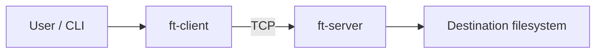
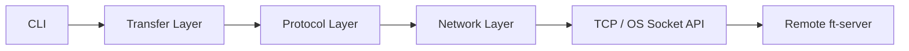

# Architecture

## Context



## Container view



## Component responsibilities

### Client

- Parse command-line arguments.
- Open and validate the source file.
- Send protocol metadata.
- Stream bounded-size chunks.
- Report transfer progress.

### Server

- Listen for TCP connections.
- Validate protocol headers and message order.
- Validate received file metadata.
- Stream chunks directly to disk.
- Reject unsafe destination filenames.
- Verify that the received size matches the announced size.

### Network layer

`TcpSocket` hides Windows Winsock and POSIX socket differences. Ownership follows RAII and copying sockets is disabled.

### Protocol layer

The protocol is framed with a magic value, version, message type, and 64-bit payload size. Multi-byte fields use big-endian encoding so the wire representation is independent of host endianness.

## Data flow

```text
Source file
    |
    v
FileReader -- 4 MiB bounded buffer --> Protocol Encoder
                                           |
                                           v
                                      TCP Socket
                                           |
                                           v
                                      TCP Socket
                                           |
                                           v
                                      Protocol Parser
                                           |
                                           v
                                      FileWriter
                                           |
                                           v
                                    Destination file
```

## Current protocol sequence

```text
Client                         Server
  |                              |
  |--------- HELLO ------------>|
  |                              |
  |-------- FILE_INFO ---------->|
  |                              |
  |---------- CHUNK ------------>|
  |---------- CHUNK ------------>|
  |            ...               |
  |---- TRANSFER_COMPLETE ------>|
  |                              |
```

## Evolution plan

The next protocol revision will add application-level acknowledgements, chunk hashes, end-to-end file hashing, and resumable-transfer state. TLS will be introduced below the application protocol so confidentiality and peer authentication are independent of file-transfer semantics.
